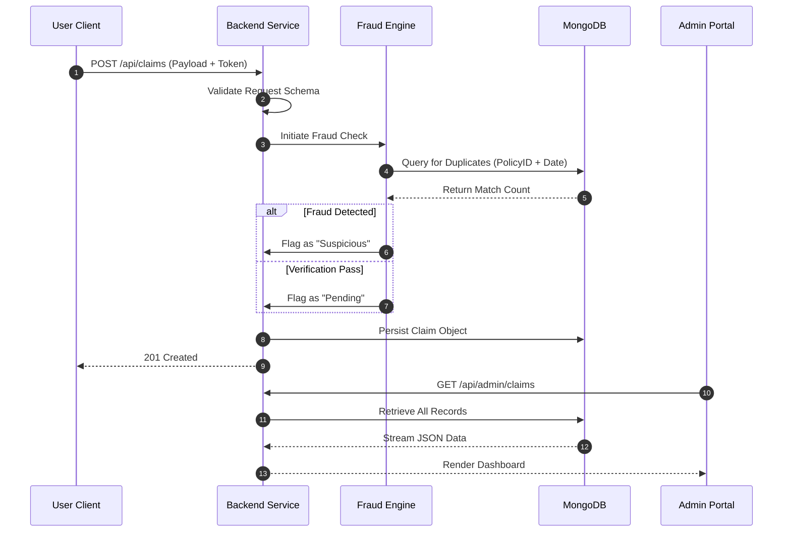

# ClaimGuard: Automated Insurance Fraud Detection System

**Version:** 1.0.0  
**Repository:** [github.com/Aditya0825-crypto/ClaimGuard](https://github.com/Aditya0825-crypto/ClaimGuard)

---

## 1. Abstract

ClaimGuard is a dual-portal insurance management platform designed to mitigate fraud through automated data verification. In modern insurance infrastructures, manual claim processing is susceptible to inefficiencies and human error. ClaimGuard addresses these challenges by implementing a distributed system with Role-Based Access Control (RBAC) and algorithmic fraud detection. The system enables policyholders to securely submit claims while providing administrators with real-time analytical tools to verify and adjudicate submissions efficiently.

## 2. System Architecture

The project utilizes a tiered monorepo architecture, ensuring separation of concerns between the client presentation layers and the server-side business logic.

### 2.1 Technical Stack

*   **Runtime Environment:** Node.js (v16+)
*   **Server Framework:** Express.js (RESTful API architecture)
*   **Database:** MongoDB (NoSQL Document Store)
*   **Object Modeling:** Mongoose
*   **Frontend Library:** React.js (Component-based UI)
*   **Authentication Protocol:** JSON Web Tokens (JWT) with BCrypt hashing

### 2.2 Data Flow Diagram

The following sequence diagram models the lifecycle of a claim transaction from submission to adjudication.



## 3. Database Schema Design

The system relies on a Schema-less NoSQL configuration, strictly verified by application-level Mongoose validators.

### 3.1 User Collection (`users`)
| Field | Type | Modifiers | Description |
| :--- | :--- | :--- | :--- |
| `_id` | ObjectId | `PK` | Unique system identifier |
| `name` | String | `Required` | Full legal name |
| `email` | String | `Unique`, `Indexed` | System login credential |
| `password` | String | `Hash` | BCrypt encrypted string |
| `role` | Enum | `['user', 'admin']` | Access privilege level |

### 3.2 Claim Collection (`claims`) *(Proposed)*
| Field | Type | Description |
| :--- | :--- | :--- |
| `policyNumber` | String | Reference to the insurance policy |
| `incidentDate` | Date | Timestamp of the alleged incident |
| `description` | String | Narrative of the event |
| `evidenceLinks` | Array[String] | URIs to uploaded documents/images |
| `status` | Enum | `Pending`, `Approved`, `Rejected`, `Flagged` |
| `riskScore` | Number | Computed fraud probability impact (0-100) |

## 4. Algorithmic Modules

### 4.1 Automated Fraud Detection
The system employs a deterministic rule-based engine to pre-screen claims before human review.
*   **Duplicate Detection:** Checks for existing claims with identical `policyNumber` and `incidentDate` within a sliding window (e.g., 30 days).
*   **Metadata Analysis:** Validates that `incidentDate` is not in the future and strictly follows policy activation periods.

### 4.2 Security Implementation
*   **Stateless Authentication:** Usage of JWT allows for horizontal scalability without server-side session storage.
*   **Password Salting:** All credentials are hashed with a salt factor of 10 prior to persistence.

## 5. API Reference Specifications

The backend exposes a RESTful interface consuming and producing `application/json`.

| Endpoint | Method | Access Level | Description |
| :--- | :--- | :--- | :--- |
| `/api/auth/register` | `POST` | Public | Registers a new discrete user entity. |
| `/api/auth/login` | `POST` | Public | Authenticates credentials and issues JWT. |
| `/api/claims` | `POST` | User | Submits a claim payload for processing. |
| `/api/admin/dashboard`| `GET` | Admin | Retrieves aggregated metrics and active queues. |

## 6. Setup and Installation

### 6.1 Prerequisites
*   Node.js Runtime Environment
*   MongoDB Instance (Local or Atlas Cluster)

### 6.2 Deployment Instructions

1.  **Repository Initialization**
    ```bash
    git clone https://github.com/Aditya0825-crypto/ClaimGuard.git
    cd ClaimGuard
    ```

2.  **Dependency Resolution**
    Execute the following in `backend`, `user-frontend`, and `admin-frontend` directories:
    ```bash
    npm install
    ```

3.  **Environment Configuration**
    Define the server environment vector in `backend/.env`:
    ```env
    PORT=5000
    MONGO_URI=<connection_string>
    JWT_SECRET=<cryptographic_key>
    ```

4.  **Service Execution**
    *   **Backend:** `npm run dev` (Port 5000)
    *   **Clients:** `npm run dev` (Vite Default Ports)

---

## 7. Future Scope
*   Integration of Computer Vision (CNNs) for automated damage assessment from image evidence.
*   Blockchain implementation for immutable audit logs of claim decisions.

---
