<div align="center">
  <h1>🛡️ ClaimGuard</h1>
  <h3><i>Automated Insurance Fraud Detection & Management System</i></h3>
  <p>
    <b>Version:</b> 1.0.0 &nbsp;|&nbsp; <b>License:</b> MIT &nbsp;|&nbsp; <b>Stack:</b> MERN
  </p>
</div>

---

## 📑 Abstract

**ClaimGuard** is a dual-portal insurance management platform designed to mitigate fraud through automated data verification. In modern insurance infrastructures, manual claim processing is susceptible to inefficiencies and human error. ClaimGuard addresses these challenges by implementing a distributed system with **Role-Based Access Control (RBAC)** and **Algorithmic Fraud Detection**. The system enables policyholders to securely submit claims while providing administrators with real-time analytical tools to verify and adjudicate submissions efficiently.

---

## 🏛️ System Architecture

The project utilizes a tiered **Monorepo Architecture**, ensuring distinct separation of concerns between the client presentation layers and the server-side business logic.

### 2.1 Technical Stack 🛠️

| Component | Technology | Justification |
| :--- | :--- | :--- |
| **Runtime** | **Node.js (v16+)** | asynchronous I/O for high-concurrency API handling. |
| **Server** | **Express.js** | Minimalist framework for robust RESTful API architecture. |
| **Database** | **MongoDB** | NoSQL Document Store for flexible schema evolution. |
| **Frontend** | **React.js** | Component-based UI for dynamic state management. |
| **Auth** | **JWT + BCrypt** | Stateless authentication for horizontal scalability. |

### 2.2 Data Flow Diagram 🔄

The following sequence diagram models the lifecycle of a claim transaction from submission to adjudication.

```mermaid
sequenceDiagram
    autonumber
    participant Client as 👤 User Client
    participant API as ⚙️ Backend Service
    participant Engine as 🤖 Fraud Engine
    participant DB as 💾 MongoDB
    participant Admin as 👮 Admin Portal

    Client->>API: POST /api/claims (Payload + Token)
    API->>API: Validate Request Schema
    API->>Engine: Initiate Fraud Check
    Engine->>DB: Query for Duplicates (PolicyID + Date)
    DB-->>Engine: Return Match Count
    
    alt Fraud Detected ⚠️
        Engine->>API: Flag as "Suspicious"
    else Verification Pass ✅
        Engine->>API: Flag as "Pending"
    end

    API->>DB: Persist Claim Object
    API-->>Client: 201 Created

    Admin->>API: GET /api/admin/claims
    API->>DB: Retrieve All Records
    DB-->>API: Stream JSON Data
    API-->>Admin: Render Dashboard
```



---

## 💾 Database Schema Design

The system relies on a Schema-less NoSQL configuration, strictly verified by application-level Mongoose validators.

### 3.1 User Collection (`users`) 👤
| 🔑 Field | 📄 Type | ⚙️ Modifiers | 📝 Description |
| :--- | :--- | :--- | :--- |
| `_id` | `ObjectId` | `PK` | Unique system identifier |
| `name` | `String` | `Required` | Full legal name |
| `email` | `String` | `Unique`, `Index` | System login credential |
| `password` | `String` | `Hash` | BCrypt encrypted string |
| `role` | `Enum` | `['user', 'admin']` | Access privilege level |

### 3.2 Claim Collection (`claims`) 📄 *(Proposed)*
| 🔑 Field | 📄 Type | 📝 Description |
| :--- | :--- | :--- |
| `policyNumber` | `String` | Reference to the insurance policy |
| `incidentDate` | `Date` | Timestamp of the alleged incident |
| `description` | `String` | Narrative of the event |
| `evidenceLinks` | `String[]` | URIs to uploaded documents/images |
| `status` | `Enum` | `Pending`, `Approved`, `Rejected`, `Flagged` |
| `riskScore` | `Number` | Computed fraud probability (0-100) |

---

## 🧠 Algorithmic Modules

### 4.1 Automated Fraud Detection 🚨
The system employs a deterministic rule-based engine to pre-screen claims before human review.

> **ℹ️ Logic:** The algorithm queries the database for any existing claims that match the input `policyNumber` and `incidentDate`. If a match is found within a 30-day sliding window, the system automatically flags the new submission as a **Duplicate** to prevent double-payouts.

### 4.2 Security Implementation 🔐
*   **Stateless Authentication:** Usage of **JWT** allows for horizontal scalability without server-side session storage.
*   **Password Salting:** All credentials are hashed with a salt factor of 10 prior to persistence using **BCrypt**.

---

## 📡 API Reference Specifications

The backend exposes a RESTful interface consuming and producing `application/json`.

| 🔗 Endpoint | ⚡ Method | 🔒 Access | 📝 Description |
| :--- | :--- | :--- | :--- |
| `/api/auth/register` | `POST` | Public | Registers a new discrete user entity. |
| `/api/auth/login` | `POST` | Public | Authenticates credentials and issues JWT. |
| `/api/claims` | `POST` | User | Submits a claim payload for processing. |
| `/api/admin/dashboard`| `GET` | Admin | Retrieves aggregated metrics and active queues. |

---

## ⚙️ Setup and Installation

### 6.1 Prerequisites
*   Node.js Runtime Environment
*   MongoDB Instance (Local or Atlas Cluster)

### 6.2 Deployment Instructions

1.  **Repository Initialization**
    ```bash
    git clone https://github.com/Aditya0825-crypto/ClaimGuard.git
    cd ClaimGuard
    ```

2.  **Dependency Resolution**
    Execute the following in `backend`, `user-frontend`, and `admin-frontend` directories:
    ```bash
    npm install
    ```

3.  **Environment Configuration**
    Define the server environment vector in `backend/.env`:
    ```env
    PORT=5000
    MONGO_URI=<connection_string>
    JWT_SECRET=<cryptographic_key>
    ```

4.  **Service Execution**
    *   **Backend:** `npm run dev` (Port 5000)
    *   **Clients:** `npm run dev` (Vite Default Ports)

---

## 🔮 Future Scope
*   🔹 **Computer Vision (CNNs)**: Automated damage assessment from image evidence.
*   🔹 **Blockchain Ledger**: Immutable audit logs of claim decisions.

---
<div align="center">
  <i>BY - Aditya Chaubey</i>
</div>
